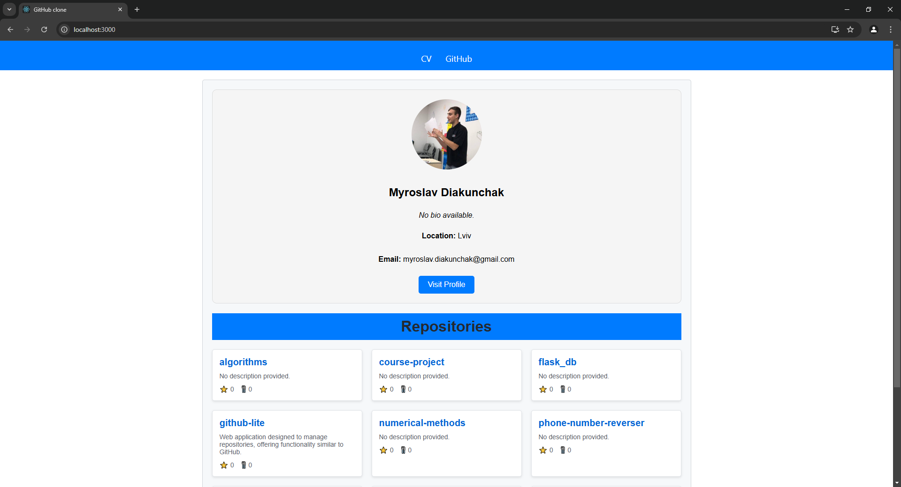
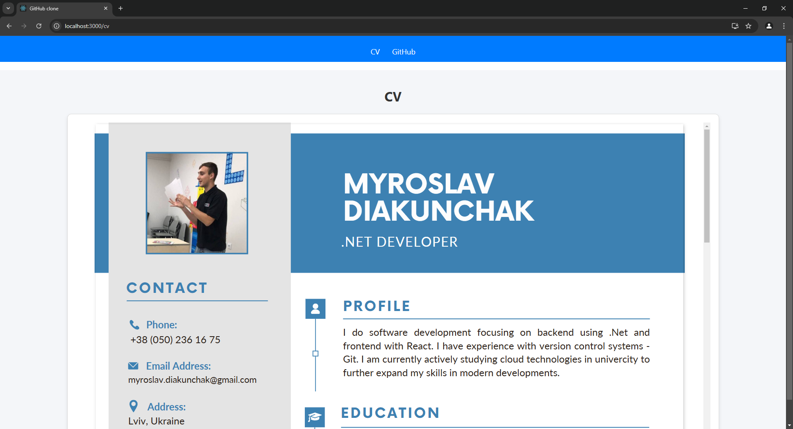
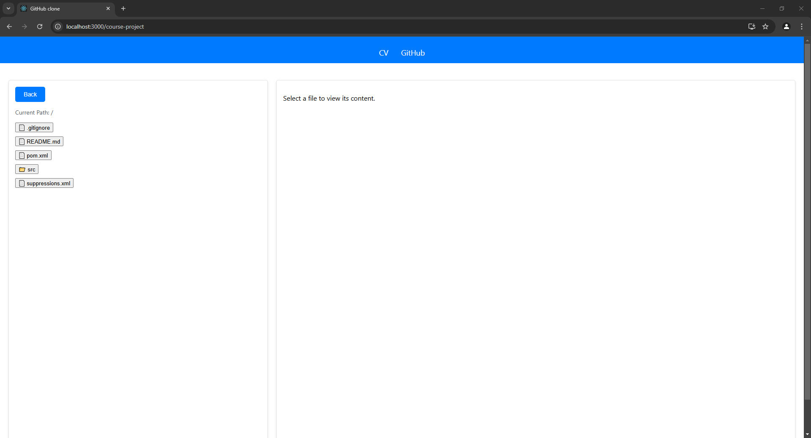
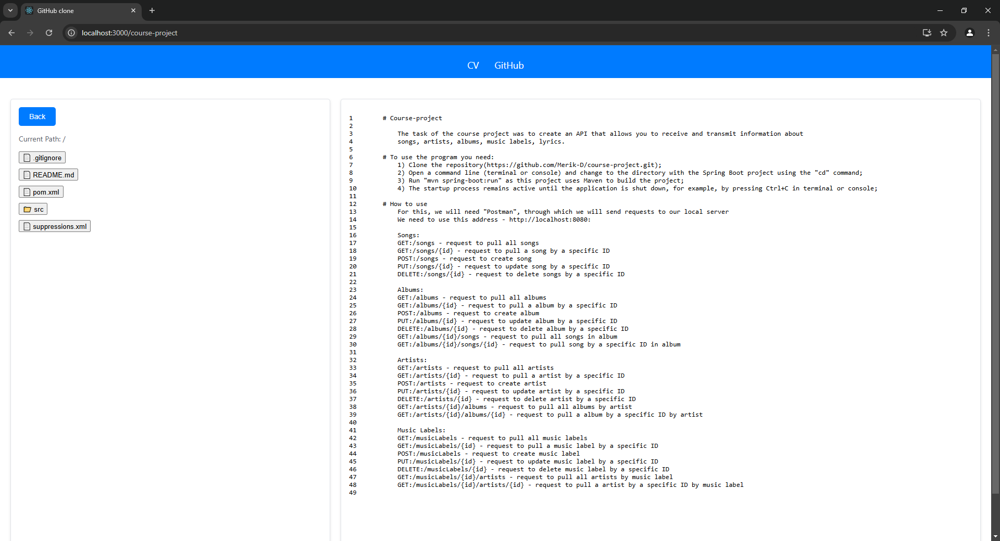

# github-lite
Web application designed to manage repositories, offering functionality similar to GitHub.

## Main Page

This screenshot shows the main page of the app, where the user can see the list of repositories. It displays basic user information along with repositories, their descriptions, and additional details like the number of stars and forks.

## CV Page

This screenshot displays the user's CV page. Here, basic information about the user, their skills, and experience can be seen.

## Chosen Repository

This screenshot shows the contents of a chosen repository. The repository displays a list of files and folders, along with the relative path of each item within the repository. The user can navigate through different folders to explore the repository structure.

## Chosen File

This screenshot shows a selected file from the repository. It displays the file's content, allowing users to view the contents of the file directly within the application.
